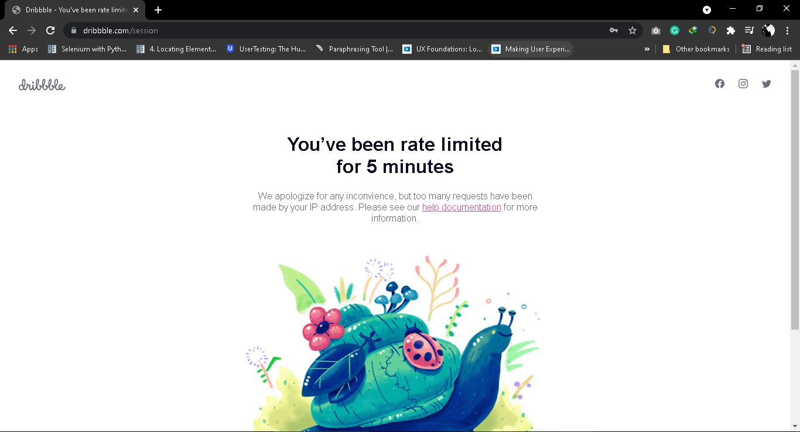

<h1 align="center"> 
<b>Automation Testing</b>
</h1>

Sebuah projek akhir bootcamp dari <b>PyAutoID</b> untuk melakukan test aplikasi berbasis <i>Web-Browser</i> secara otomatis. Testing menggunakan <b>Selenium</b> dengan bahasa yang digunakan adalah <b>Python</b>. Dengan <b>Pytest</b> sebagai framework testing tersebut. Dan hasil report dalam bentuk <b>html</b>.

 

<h2><b>Project's Description</b>
</h2>

<b>Automation Testing</b> adalah melakukan uji perangkat lunak dengan secara otomatis dengan rangkaian uji yang sudah dibuat. Ini merupakan sebuah projek. Tools yang digunakan disini adalah <b>Selenium</b> yang merupakan tools auto testing yang digunakan untuk tes aplikasi berbasis <i>Web-Browser</i>.

Bahasa pemrograman yang digunakan adalah <b>Python</b> untuk menulis script <b>Automation Testing</b>. Sedangkan untuk teks editor yang digunakan disini adalah menggunakan <b>Visual Studio Code</b>. <b>Automation Testing</b> ini merupakan sebuah projek akhir dari <b>Bootcamp Selenium PyAutoID</b> dengan alur tes melakukan login pada sebuah alamat Web. Framework testing yang digunakan adalah <b>Pytest</b> yang hasil dari testing tersebut akan ditampilkan dalam bentuk <b>HTML</b>. Alamat web yang digunakan untuk testing login disini adalah <a href="url">https://dribbble.com/session/new</a> 
<h3><b>Note</b></h3>
Pada alamat web tersebut terdapat limit akses ketika login seperti gambar berikut.

 

<h1><b>Scenario Testing</b></h1>

 Berikut skenario test yang dilakukan untuk automation testing. Skenario tersebut berupa test case yang akan dilakukan pada saat testing alamat web. Sesi yang diambil disini ketika user mencoba melakukan login menggunakan alamat email yang terdaftar maupun mencoba melakukan melakukan login dengan alamat email yang tidak terdaftar. Dengan expected resultnya ketika berhasil login akan dilanjutkan ke halaman HOME dari web dan ketika tidak berhasil melakukan login akan muncul notifikasi/alert bahwa email tidak terdaftar. 

<table>
<tr>
    <th>Test_ID</th>
    <th>Session</th>
    <th>Summary</th>
    <th>Action Step</th>
    <th>Expected Result</th>
</tr>
<tr>
    <td>Test_01</td>
    <td>User</td>
    <td>As a User, You can login with a Registered Email and Pasword</td>
    <td>
        <ol>
            <li>Go to Web Address https://dribbble.com/session/new</li>
            <li>Enter Registered Email Address</li> 
            <li>Enter the Registered Password</li>
            <li>Click the Sign-in button</li>
        </ol>
    </td>
    <td>Go to the Home Page</td>
</tr>
<tr>
    <td>Test_02</td>
    <td>User</td>
    <td>As a User, can't login with Unregistered Email</td>
    <td>
        <ol>
            <li>Go to Web Address https://dribbble.com/session/new</li>
            <li>Enter Unregistered Email Address</li> 
            <li>Enter Registered Password</li>
            <li>Click the Sign-in button</li>
        </ol>
    </td>
    <td>There is a notification or alert the account is not registered</td>
</tr>
<tr>
    <td>Test_03</td>
    <td>User</td>
    <td>As a User, can't login with Unregistered Password</td>
    <td>
        <ol>
            <li>Go to Web Address https://dribbble.com/session/new</li>
            <li>Enter Registered Email Address</li> 
            <li>Enter Unregistered Password</li>
            <li>Click the Sign-in button</li>
        </ol>
    </td>
    <td>There is a notification or alert the account is not registered</td>
</tr>
<tr>
    <td>Test_04</td>
    <td>User</td>
    <td>As a User, can't login with Unregistered Email and Password</td>
        <td>
        <ol>
            <li>Go to Web Address https://dribbble.com/session/new</li>
            <li>Enter Unregistered Email Address</li> 
            <li>Enter Unregistered Password</li>
            <li>Click the Sign-in button</li>
        </ol>
    </td>
    <td>Go to the Home Page</td>
</tr>
</table>

<h2><b>Dependencies</b>
</h2>

<li>Operating System : Windows 10.</li>
<li>Teks Editor : Visual Studio Code.</li>
<li>Automation Tools : Selenium.</li>
<li>WebDriver : Chrome Driver.</li>
<li>Progamming Language : Python.</li>
<li>Framework Testing : Pytest.</li>
<li>Report Model : HTML.</li>
<li>Test Scenario</li>

 

<h2><b>Installing</b>
</h2>

<ul>
    <li>Install <b>Visual Studio Code</b> and <b>Python</b></li>
    <ol>
    <li>Download and Install <b>Visual Studio Code</b> :
    <a href="url">https://code.visualstudio.com/download</a></li>
    <li>Download and Install <b>Python</b> :
    <a href="url">https://www.python.org/downloads/</a></li>
    </ol>
    <li>Install <b>WebDriver</b></li>
    Driver disini tergantung web browser yang digunakan, dalam hal ini digunakan Chrome Driver. Dan jika menggunakan Chrome Driver diharapkan menggunakan versi terbaru sesuai versi yang ada pada Chrome. Berikut link download.
    <a href="url">https://chromedriver.chromium.org/</a>
    <li>Install <b>Selenium</b></li>
    Buka Command Prompt lalu masukkan perintah dibawah. Maka selenium akan terinstall.
    
pip install selenium

    <li>Install <b>Pytest</b></li>
    Buka Command Prompt lalu masukkan perintah dibawah. Maka pytest akan otomatis terinstall.
    
pip install pytest

    <li>Install <b>Pytest Html</b></li>
    Buka Command Prompt lalu masukkan perintah dibawah. Maka pytest html akan otomatis terinstall.
    
pip install pytest-html

</ul>

 

<h2><b>Executing Program</b>
</h2>

<ul>
    <li>Memulai program dengan memasukkan library webdriver dari selenium dan juga pytest dengan memasukkan perintah</li> 
    

    from selenium import webdriver
     import pytest 
    

    <li>Memasukkan script untuk melakukan testing secara otomatis. Berikut listing program automation tersebut</li>
    
    
    <li>Menjalankan perintah tersebut dengan memasukkan perintah pada terminal yang terdapat pada teks editor sebagai berikut.</li>
    

    python -m pytest -v test_namafile.py
    

    Maka akan memunculkan output seperti gambar dibawah.
    
    <li>Membuat output report kedalam bentuk html dengan memasukkan perintah berikut kedalam terminal.</li>
    

    python -m pytest -v test_namafile.py --html=namafilereport.html
    

    Maka hasil dari perintah tersebut akan memberikan file dalam bentuk html sebagai berikut.
    
    Sehingga lebih mudah dibaca daripada hasil output yang ditampilkan pada terminal.
</ul>

 

<h1><b>Author</b></h1>

Mohammad Febrian Nur Ghifari Ramadhan
 Email : febrian0530@gmail.com
 Instagram : @mfebrianngr

 

<h1><b>Acknowledgments</b></h1>
<ul>
<li>PyAutoID yang telah memberi kesempatan untuk mengikuti Bootcamp </li>
<li>InterviewBit untuk gambar diawal judul</li>
</ul>

